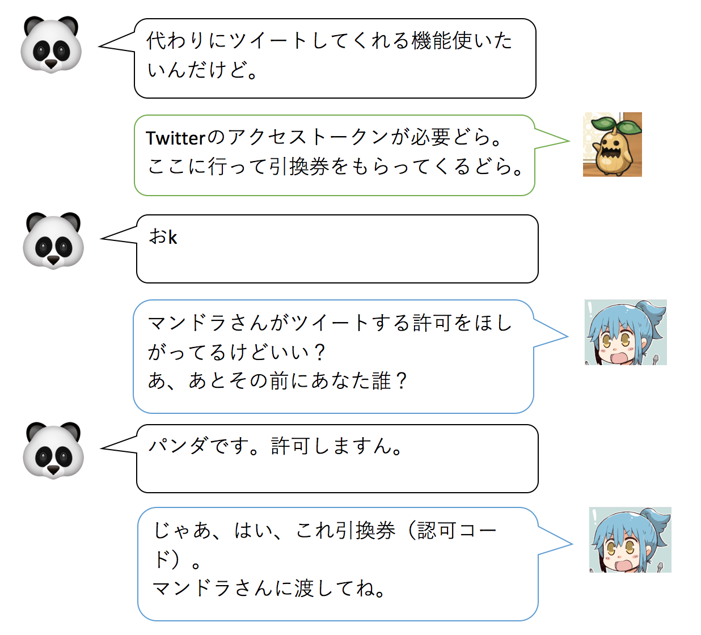
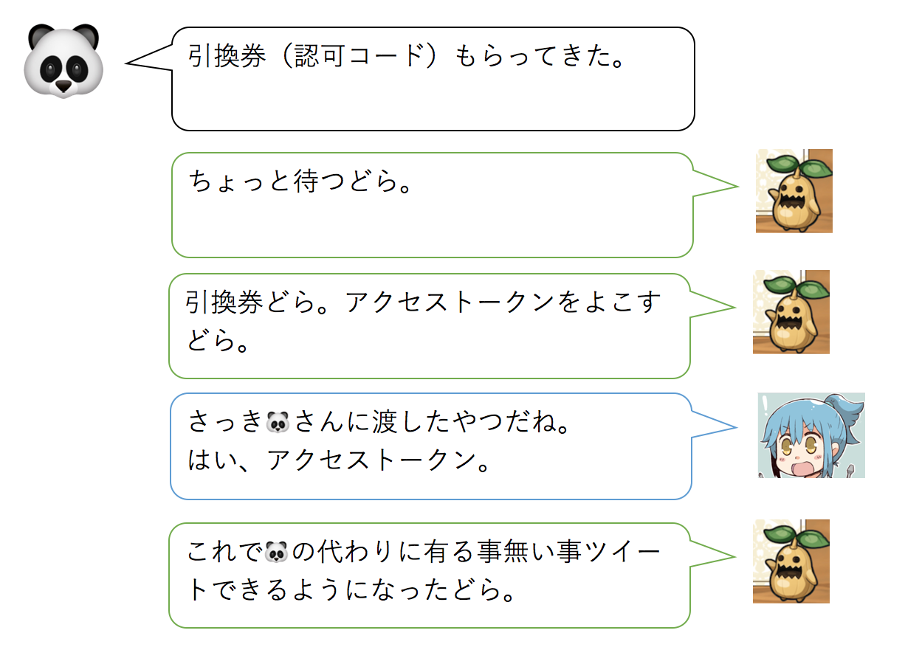
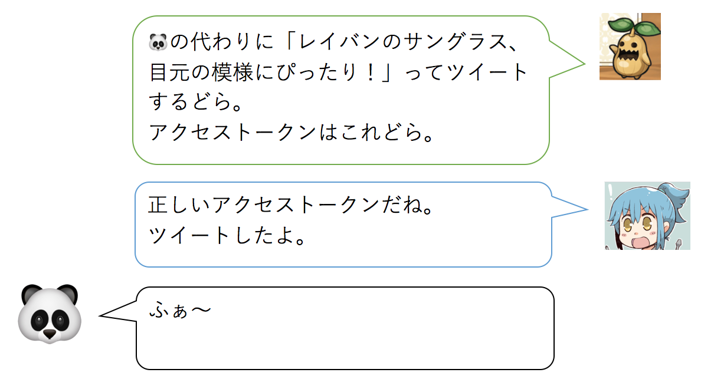
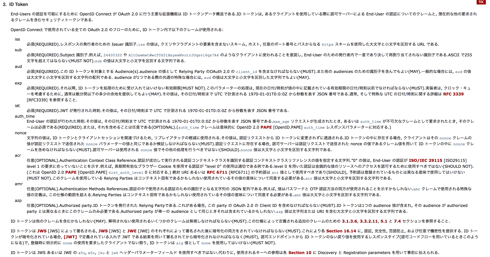
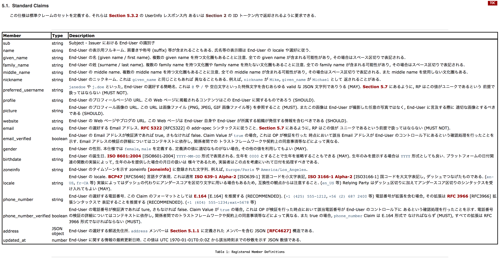

% OAuth 2.0とOpenID Connect入門
% yamotonalds
% 2017-01-30

# OAuth 2.0とOpenID Connect入門

## なぜこの内容にしたか

GCSにファイルをアップロードしているところで

>invalid_grant: Invalid JWT: Token must be a short-lived token and in a reasonable timeframe

## 原因としてはサーバーの時刻ずれ

[Google OAuth2.0 認証時に JWT::InvalidIatError: Invalid iat エラーが頻発する@NOTE](https://note.aiming-inc.biz/posts/787)

これを期に認証周りの仕組みを再確認しておこう 🐼

## ちなみに

JWTはジョットと発音するそうです。

[https://tools.ietf.org/html/rfc7519#section-1](https://tools.ietf.org/html/rfc7519#section-1)

# OAuth 2.0とOpenID Connect

## Google APIの認証・認可

認可にOAuth 2.0、認証にOpenID Connectを使っている
[https://developers.google.com/identity/protocols/OAuth2](https://developers.google.com/identity/protocols/OAuth2)

## OAuth 2.0とは

ユーザーがアプリケーションにID・パスワードを教えることなく、アプリケーションがユーザーの代わりにユーザーデータにアクセスできるようにする仕組み

*安全に* 認可を取得するための認可プロセスを規定する

## OpenID Connectとは

OAuth 2.0の仕組みに乗っかって認証の仕組みを規定したもの

# OAuth 2.0

## OAuth 2.0が決めるもの

- アプリケーションがどうやってアクセストークンを取得するか
- リクエスト・レスポンス（成功・失敗）の仕様

## 用語説明

- アクセストークン(Access Token)
    - ユーザーリソースにアクセスするためのトークン
- 認可グラント(Grant)
    - アクセストークンを取得するための方法
    - OAuth 2.0では4つ定義されている
- クレデンシャル(Credential)
    - 認証情報

## 登場人物

- リソースオーナー
    - ユーザーのこと 
- リソースサーバー
    - ユーザーデータを持っているサーバー 
- クライアント
    - OAuthを使うアプリケーション 
- 認可サーバー
    - ユーザーから認可を取得し、アクセストークンを発行するサーバー 

## プロセスフロー

※ 認可コード(AuthorizationCode)Grantの例

## 

## 

## 注目点

- ユーザー()の認証は認可サーバー()が必要だからやってる
- クライアント()はユーザー()の認証情報を知らない
- リソースオーナー()はアクセストークンを知らない
- リソースサーバー()はユーザーの認証情報やアクセストークンの入手経路は気にしない。アクセストークンが正しいかどうかだけが問題

## ここで話さなかったこと

- アクセストークンのスコープ(scope)
    - 何を許可するか
- リフレッシュトークンとトークンエンドポイント
    - 毎回アクセストークンを発行するのはコストが高い
- クライアント登録
    - 認証情報以外にリダイレクトURLも登録する
- CSRF対策(state)等セキュリティの細かい話

詳細はWebで！
[https://openid-foundation-japan.github.io/rfc6749.ja.html](https://openid-foundation-japan.github.io/rfc6749.ja.html)

# OpenID Connect

## OpenID Connectが決めるもの

OAuth 2.0で行われるユーザーの認証はおまけだった。OpenID Connectではアクセストークンと一緒に認証結果を返したり、アクセストークン取得後にユーザー情報を取得するためのエンドポイントに対するリクエスト・レスポンスも仕様化した。

## 用語説明

- クレーム(Claim)
    - データ(Entity に関する情報の部分集合)
- ID Token
    - 認証結果に使用されるデータ構造
    - JWT形式
- UserInfo Endpoint
    - アクセストークンを使ってユーザー情報を取得するための受け口

## 登場人物

- End-User
    - ユーザー
- RP(Relying Party)
    - OAuth 2.0でいうところのクライアント
- OP(OpenID Provider)
    - OpenID ConnectをサポートするOAuth 2.0の認可サーバー

## プロセスフロー

※ OpenID Connectには3つのフローがあるが、ここではAuthorization Code Flowの例

認可コード（引換券）の取得までは同じ。

認可コードを使ってアクセストークンを取得する際に、アクセストークンと一緒にID Tokenが返される。

ID TokenにはユーザーのID(sub)等が含まれている。

それだけ。

## OpenID Connect薄くない？

## ID Token仕様

## ユーザー情報の基本定義

## 他にも

- Hybrid Flow
- 暗号化
- 署名
- 検証
- その他セキュリティ対策 etc...

. . .

薄くはない

# 冒頭のエラーに戻る

##

>invalid_grant: Invalid JWT: Token must be a short-lived token and in a reasonable timeframe

## invalid_grant

OAuth 2.0のアクセストークン取得時のエラーレスポンスに定義されているエラーコード

## JWT, timeframe

OpenID ConnectのID Tokenの仕様で

>実装者は, クロック・キューを考慮するために, 通常は数分間以下の多少の余地を提供してもよい(MAY)

## 

また、ID Tokenの検証で

>iat Claim は現在時刻からはるか昔に発行されたトークンを拒絶するために利用でき, 攻撃を防ぐために nonce が保存される必要がある期間を制限する. 許容できる範囲は Client の仕様である.

## 

って感じであのエラーはOAuth 2.0またはOpenID Connectの現在時刻絡みのエラーかな、ということがわかる。

# まとめ

## OAuth 2.0

- ユーザーが安全にリソースアクセス許可（認可）を出すための仕組み
- アクセストークンが大事
- 仕組みは安全だけど安易に許可したりアプリケーション自体が信用できなかったりすると意味無い
- （あと実装者が実装サボった場合も危険）

## OpenID Connect

- OAuth 2.0前提で認証に関して規定したもの
- アクセストークンを使ったユーザー情報の取得まで決められている
- JWTがガンガン出てくる
- 現在時刻とかにも結構うるさい

## 参考URL

OAuth 2.0
[https://openid-foundation-japan.github.io/rfc6749.ja.html](https://openid-foundation-japan.github.io/rfc6749.ja.html)

OpenID Connect
[https://openid-foundation-japan.github.io/openid-connect-core-1_0.ja.html](https://openid-foundation-japan.github.io/openid-connect-core-1_0.ja.html)

Google Cloud Platform Auth ガイド
[https://cloud.google.com/docs/authentication](https://cloud.google.com/docs/authentication)

Using OAuth 2.0 to Access Google APIs
[https://developers.google.com/identity/protocols/OAuth2](https://developers.google.com/identity/protocols/OAuth2)

